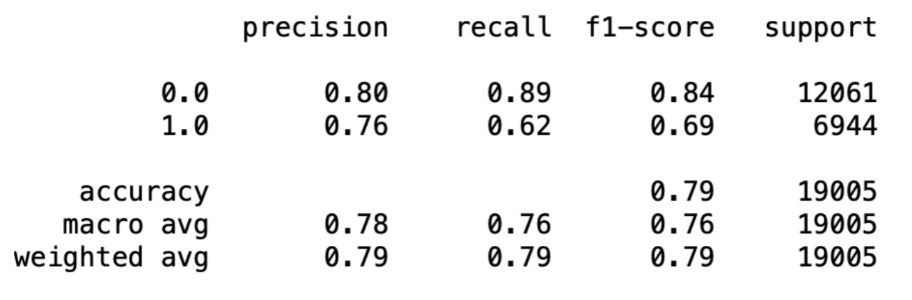

# Environments
The codebase is developed with Python 3.8. Install requirements as follows:
```
pip3 install -r requirements.txt
```

## LSTM model
I build the Long short-term memory model using Tensorflow. it take 20-30 minutes. There are some overfiting after 30 epochs, so we can early stop at 30. The best accuracy of training is 0.92, and accuracy of validation is 0.91.
```
python3 train.py LSTM 
```

## Ensembling model(Random Forest and ExtraTrees)
It is much slower than LSTM, it costs more than 40 minutes. i tried hyperparameter tuning two model and ensemble. The best acc of training is 0.93, but the acc of validation is 0.79. In next step, can try the data augmentation to avoid the overfitting.
```
python3 train.py ENSEMBLE
```

# Results
## LSTM model


## Ensemble model


## notebook
users also can run the 'gender-detection.ipynb' to check training and result 

# Model deployment
## Inference
```
python3 inference.py
```

## Flask app
run the app.py to build the flash app. need use postman to test the app, , and api address: http://127.0.0.1:5000/inference. post a json content:{"name":"Joe"}'

```
python3 app.py
```

## dockerfile
1. Build the image
```
docker build -t gender_detection:1.0 .
```
2. Run the app
```
docker run -p 5000:5000 gender_detection:1.0
```
3. Test
```
curl -X POST http://127.0.0.1:5000/inference -H 'Content-Type:application/json' -d '{"name":"Joe"}'
```


