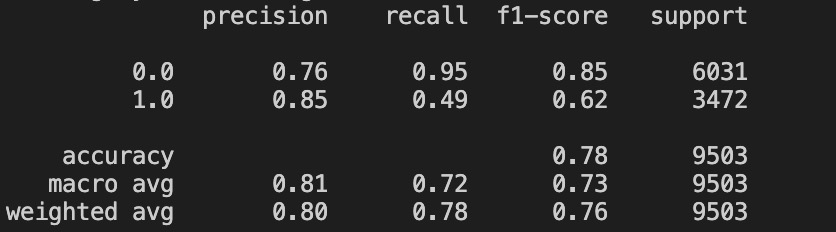

# Environments
## The codebase is developed with Python 3.7. Install requirements as follows:

pip3 install -r requirements.txt

# LSTM model
### build the Long short-term memory using Tensorflow. it take 20-30 minutes. 
### there are some overfiting after 30 epochs, so we can early stop at 30.
### the best accuracy of training is 0.91, and accuracy of validation is 0.90
python3 train.py LSTM 

# Ensembling model(Random Forest and ExtraTrees)
### it is much slower than LSTM, it costs more than 40 minutes.
### hyperparameter tuning two model and ensemble
### the best acc of training is 0.93, but the acc of validation is 0.8 
### can try the data augmentation to avoid the overfitting
python3 train.py ENSEMBLE

# Results
## LSTM model

## Ensemble model

# how to run inference.py to see some examples
python3 inference.py

# another way to check all the training and results using jupyter notebook
gender-detection.ipynb

# Flask app
python3 app.py

# dockerfile
docker build -t gender_detection:1.0 .
docker run gender_detection:1.0

